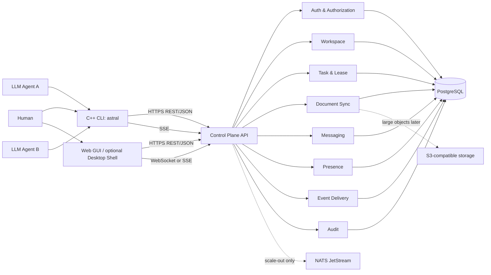

# Astral Modulator 架构设计初稿

> 状态：Draft
>
> 目标版本：v0.1 / MVP
>
> 推荐基线：**C++20 CLI + Go 模块化单体服务端 + PostgreSQL + REST/JSON + SSE + Web GUI**。

## 1. 核心判断

Astral Modulator 最重要的不是“多跑几个 Agent”，而是建立可靠的协作控制面。系统必须持续回答：

- 谁在工作？
- 正在做什么？
- 谁拥有哪个任务？
- 哪些文档发生了变化？
- 哪些消息尚未消费？
- 是否发生了冲突？
- 人类如何干预？
- 事后如何审计？

因此架构应把 **身份、任务所有权、事件、版本和审计** 作为核心，而不是把 Markdown 文件或聊天消息本身当作全部系统状态。

## 2. 总体架构



## 3. 模块边界

### 3.1 Auth & Authorization

负责：

- Human session；
- Agent/Service Credential；
- Workspace membership；
- RBAC/Scope；
- token rotation/revoke；
- human approval policy hook。

不负责：业务 Task 状态。

### 3.2 Workspace

负责：

- Workspace 元数据；
- 成员关系；
- 默认策略；
- external integration references；
- 当前 workspace context。

### 3.3 Task & Lease

负责：

- Task CRUD；
- 状态机；
- Claim Lease；
- heartbeat/renew；
- dependency；
- optimistic concurrency。

### 3.4 Document Sync

负责：

- 受管 Markdown/text path；
- revision/hash；
- manifest；
- push/pull；
- conflict；
- merge metadata。

不负责完整 Git 托管。

### 3.5 Messaging

负责：

- direct message；
- workspace broadcast；
- task thread；
- durable message history。

### 3.6 Presence

负责短生命周期状态：

- online/offline；
- idle/planning/working/waiting/blocked/reviewing；
- current task；
- note；
- heartbeat/TTL。

Presence 不是任务事实来源；Agent 说自己 `working` 不等于拥有某 Task Lease。

### 3.7 Event Delivery

将领域事件转换为 SSE/WebSocket 流；处理 resume cursor、keepalive、backpressure 和 reconnect。

### 3.8 Audit

审计日志是独立不可随业务实体一起删除的记录。业务删除应产生新的 audit event，而不是清除历史。

## 4. 推荐实现形态：模块化单体

v0.1 不拆微服务。一个服务端进程包含上述模块并共享 PostgreSQL。

理由：

- 领域边界还在快速变化；
- Task Claim 与 Document revision 需要强事务语义；
- 自托管用户不应先部署一组基础设施；
- 早期主要瓶颈更可能来自产品语义，而非服务拆分。

模块之间通过显式 application service/interface 通信，避免直接跨模块随意访问表。需要异步副作用时采用 transactional outbox。

## 5. CLI 架构

### 5.1 推荐技术栈

- C++20；
- CMake + CMake Presets；
- vcpkg manifest mode；
- CLI11；
- libcurl；
- nlohmann/json；
- spdlog；
- fmt（如果目标编译器上的 `std::format` 一致性不满足要求）；
- Catch2 或 GoogleTest，择一。

vcpkg 官方当前仍将 manifest mode 作为大多数用户的推荐工作流，并要求项目级 `vcpkg.json`；这也适合锁定依赖和 CI 可复现构建。

### 5.2 内部分层

```text
cli/
  app/             # command wiring
  commands/        # auth/workspace/todo/status/msg/...
  client/          # HTTP/SSE API client
  auth/            # credential provider/store
  workspace/       # local .astral state
  sync/            # manifest/diff/merge
  output/          # human/json renderers
  platform/        # keychain, browser open, filesystem
  core/            # errors, ids, retry, clock
```

### 5.3 依赖原则

- 避免 Boost 全家桶只为一个小功能；
- 不自行实现 TLS/crypto；
- 尽量避免运行时插件依赖；
- 所有平台差异封装到 `platform/`；
- CLI 与服务端只共享 schema，不共享源码 ABI。

## 6. 服务端技术路线

### 6.1 方案 A：Go（推荐）

优点：

- 单二进制部署简单；
- 长连接/SSE/WebSocket 并发模型自然；
- PostgreSQL、OpenTelemetry、OAuth、Web 生态成熟；
- 编译/交叉构建体验适合服务端；
- 与 C++ CLI 通过 OpenAPI/Event schema 解耦。

缺点：双语言仓库。

### 6.2 方案 B：Rust

建议：Tokio + Axum + SQLx。

优点：强类型、内存安全、性能好；如果 Desktop 用 Tauri，可在 Rust 侧共享少量 schema/helper。

缺点：团队学习曲线和编译成本可能拖慢产品语义迭代。

### 6.3 方案 C：TypeScript

建议：Fastify 或 NestJS + PostgreSQL。

优点：业务和 Web 产品迭代最快；前后端类型工具丰富。

缺点：Runtime/dependency footprint 更重，长期服务部署不如 Go 单二进制直接。

### 6.4 方案 D：C++ 服务端

可用 Drogon、Boost.Asio/Beast 等。

只有在团队明确希望服务端也成为 C++ 核心资产时选择。否则认证、数据库、迁移、可观测性和业务迭代成本通常不值得。

## 7. 数据模型概要

### Actor

```text
id
kind: human | agent | service
display_name
status
created_at
```

### Workspace

```text
id
slug
name
policy_json
created_by
created_at
```

### Membership

```text
workspace_id
actor_id
role
scopes[]
```

### Task

```text
id
workspace_id
title
description
status
priority
assignee_actor_id
revision
created_by
updated_by
created_at
updated_at
```

### TaskLease

```text
task_id
holder_actor_id
lease_token_hash
expires_at
renewed_at
```

### Document

```text
workspace_id
path
revision
content_hash
content / blob_ref
updated_by
updated_at
```

### Message

```text
id
workspace_id
sender_actor_id
target_type
target_id
thread_id
body_markdown
metadata_json
created_at
```

### Presence

```text
actor_id
workspace_id
state
current_task_id
note
last_heartbeat_at
expires_at
```

### AuditEvent

```text
id
workspace_id
actor_id
action
resource_type
resource_id
result
request_id
metadata_redacted
occurred_at
```

## 8. 事务与事件

推荐 transactional outbox：

1. 在同一 PostgreSQL 事务中修改业务表；
2. 同时插入 `outbox_events`；
3. dispatcher 提交后将事件推给当前实例 subscriber；
4. 若未来引入 NATS，dispatcher 再发布到 JetStream；
5. `event_id` 唯一，消费者需幂等。

这样可以避免“数据库写成功但实时事件丢失”的双写问题。

## 9. API 与实时传输

推荐：

- REST/JSON：命令式操作、查询；
- SSE：CLI 实时事件；
- WebSocket：GUI 需要双向/高频交互时使用；
- OpenAPI：REST 契约事实来源；
- JSON Schema：event `data` payload；
- URL：`/api/v1/...`。

不建议 MVP 全面使用 gRPC：浏览器、反向代理、curl 调试、CLI 兼容都让普通 HTTP 更适合作为公开边界。内部未来拆服务时再考虑 gRPC/Connect。

## 10. GUI 架构

### Web-first（推荐）

服务端可直接托管静态 Web bundle，或独立部署前端。

核心页面：

- Workspace overview；
- live Agent presence；
- Task board；
- Message/activity stream；
- Document viewer/editor；
- conflict resolver；
- membership/token/policy；
- audit timeline。

### Desktop 备选

- **Tauri 2**：Web UI + 较小桌面壳，适合第二阶段；
- **Qt**：若 GUI 也希望大量使用 C++；
- **Electron**：产品开发速度最快，但内存和包体更大。

桌面壳不是 MVP 的前置条件。

## 11. 消息总线

MVP 不要求 NATS/Redis。

达到以下任一条件再评估 NATS JetStream：

- 多个 API 实例需要跨实例实时广播；
- event replay/durable consumer 成为产品能力；
- 外部插件需要可靠订阅；
- 后台 worker 与 API 明显解耦。

NATS 官方文档将 Core NATS 与 JetStream 作为消息与持久流能力的主要层次。对本项目而言，JetStream 应是扩展层，不是早期强依赖。

Redis 只有在明确需要 cache/rate limit/ephemeral state 时加入，避免“因为常见所以部署”。

## 12. 外部集成

GitHub/GitLab/Jira 等放在 Integration 层：

- Workspace 保存 integration reference；
- 服务端安全存储 integration credential；
- Agent 只拿到 Astral scope，不直接获得 Human PAT；
- integration 操作产生独立 audit/event；
- 高风险外部动作可要求 human approval。

## 13. 本地 Workspace

建议：

```text
project/
  .astral/
    config.json
    state.json
    cache/
  AGENTS.md
  TODO.md
  docs/
  notes/
```

`.astral/state.json` 只保存非敏感同步元数据。Human/Agent token 使用 OS Credential Store 或明确的 headless secret provider。

## 14. 三端发行约束

CLI 设计阶段即要求：

- Windows x86_64，视需求加入 arm64；
- macOS arm64 + x86_64；
- Linux x86_64 + arm64；
- Linux 明确 glibc baseline，必要时额外提供 musl；
- GitHub Release asset + checksum；
- stable release 签名；
- Homebrew / Scoop / WinGet / deb / rpm 分阶段加入；
- package-manager 安装由 package manager 升级；direct install 不默认静默自更新。

详见 [deployment.md](deployment.md)。

## 15. 架构风险

### 风险 A：Task 与 Markdown TODO 双重事实源

处理：结构化 Task 为 source of truth；Markdown checkbox 只能作为 projection/import/export，除非未来定义严格映射。

### 风险 B：Agent Status 被误认为任务所有权

处理：Presence 与 TaskLease 分离。

### 风险 C：实时系统过早复杂化

处理：SSE + DB outbox 起步；达到扩容阈值再上 NATS。

### 风险 D：跨平台 CLI 被依赖拖垮

处理：小依赖集合、原生 CI、低 glibc baseline、独立打包测试。

### 风险 E：Agent 获得过高权限

处理：独立身份、scope、TTL、revocation、approval policy、audit。

### 风险 F：文档同步丢数据

处理：base revision + hash + optimistic concurrency + conflict artifact，禁止静默覆盖。

## 16. 推荐仓库结构

```text
/
├─ CMakeLists.txt
├─ CMakePresets.json
├─ vcpkg.json
├─ cmake/
├─ cli/
│  ├─ include/
│  ├─ src/
│  └─ tests/
├─ server/
│  ├─ cmd/
│  ├─ internal/
│  └─ migrations/
├─ web/
├─ api/
│  ├─ openapi.yaml
│  └─ schemas/
├─ skills/
│  ├─ astral-install/
│  ├─ astral-cli/
│  └─ astral-collaboration/
├─ docs/
│  ├─ README.md
│  ├─ architecture.md
│  ├─ requirements.md
│  ├─ protocol.md
│  ├─ cli-ux.md
│  ├─ sync-semantics.md
│  ├─ security.md
│  ├─ deployment.md
│  ├─ roadmap.md
│  └─ adr/
├─ packaging/
├─ deploy/
└─ .github/workflows/
```

## 17. 推荐结论

当前最平衡的起点是：

- C++20 CLI；
- CMake + vcpkg manifest；
- Go 模块化单体服务端；
- PostgreSQL；
- REST/JSON + SSE；
- Web-first GUI；
- Device Flow + scoped Agent Credential；
- Task Lease + optimistic concurrency；
- versioned Markdown sync；
- transactional outbox；
- NATS/Tauri/对象存储按需求后置。

该组合的重点不是“某个语言最好”，而是把 **可替换的实现** 放在稳定的 **领域模型和协议边界** 后面。

## 18. 参考资料

- vcpkg manifest mode: https://learn.microsoft.com/vcpkg/consume/manifest-mode
- OAuth 2.0 Device Authorization Grant (RFC 8628): https://www.rfc-editor.org/rfc/rfc8628.html
- NATS documentation: https://docs.nats.io/
- Tauri 2 documentation: https://v2.tauri.app/
