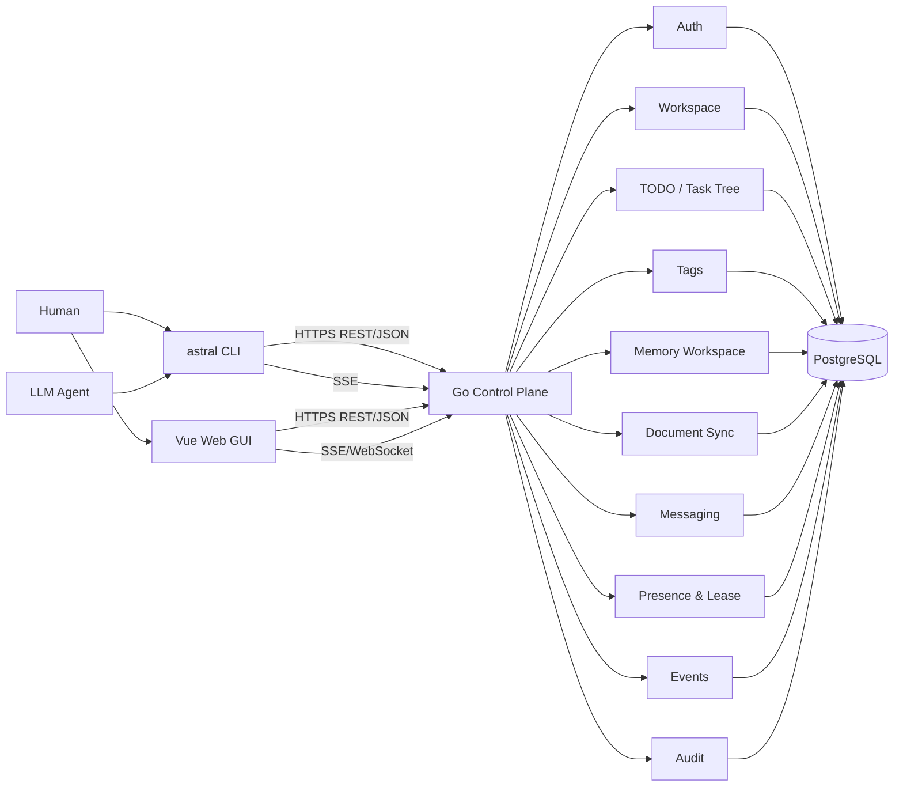

# Astral Modulator Architecture

> 状态：Accepted baseline for v0.1
>
> 仓库：`The-Astral-Express-Family/astral-modulator`
>
> 本文是服务端、Web GUI、公网协议与持久化模型架构事实来源。CLI 实现与多平台发行以 `astral-cli` 仓库为准。

## 1. 产品定位

Astral Modulator 是人类与多个 LLM Agent 共用的协作控制面。核心不是“运行 Agent”，而是持续维护可审计的协作事实：

- 谁在操作；
- 当前属于哪个服务器与 Workspace；
- TODO/Task 如何组织、检索、Claim 和完成；
- Agent 当前状态与任务租约；
- Markdown 工作区如何同步；
- Tag 如何维护且减少重复；
- 组织与项目记忆如何整理；
- 哪些操作需要二次确认；
- 谁能访问、修改、审批或撤销哪些资源；
- 事件如何实时传给 CLI 与 GUI。

服务端不实现具体 LLM 推理，也不托管 Git。任何 Agent Runtime 只要能调用公开 API 或 `astral` CLI，即可加入协作。

## 2. 双仓库结构

```text
The-Astral-Express-Family/
├─ astral-modulator
│  ├─ Go server
│  ├─ Vue web
│  ├─ PostgreSQL schema + migrations
│  ├─ OpenAPI / JSON Schema
│  ├─ auth / workspace / todo / tags / memory / sync / audit
│  └─ server deployment
│
└─ astral-cli
   ├─ C++20 CLI
   ├─ OS credential adapters
   ├─ .astral local binding
   ├─ protocol contract tests
   └─ Windows/macOS/Linux release
```

`astral-modulator` 不再包含 CLI 源码、CMake/vcpkg 发行链或 CLI 平台适配代码。

两仓库只通过版本化公网协议耦合，不共享源码 ABI，不使用 git submodule 维持同步。

## 3. 总体架构



v0.1 使用模块化单体。一个 Go 进程承载上述模块并共享 PostgreSQL。

原因：

- 当前主要风险来自产品语义，而非服务吞吐；
- Task Claim、Tag proposal、权限和审计需要强事务；
- 自托管用户不应先部署一组中间件；
- 拆微服务会提前放大运维与一致性成本。

## 4. 技术基线

服务端：

- Go；
- `net/http` + `chi`；
- PostgreSQL；
- GORM 负责普通运行时 ORM；
- goose 负责版本化 migration；
- OpenAPI 作为 REST 契约事实来源；
- JSON Schema 作为事件 payload 契约；
- SSE 作为 CLI 实时通道；
- WebSocket 仅在 GUI 确需双向高频交互时加入；
- structured logging + request ID；
- transactional outbox。

Web：

- Vue 3；
- 前后端同仓库；
- Web GUI 主要用于观察、管理、冲突解决、权限和审计。

明确不采用 Atlas。生产 migration 不依赖 GORM `AutoMigrate`。

## 5. 为什么只用 PostgreSQL，不引入 MongoDB

TODO 同时需要：

- 树形父子关系；
- Tag 多对多；
- Workspace 权限隔离；
- Claim/Lease 原子更新；
- 审计；
- 事务；
- 正则筛选；
- 模糊检索；
- 唯一约束；
- 后续统计和关联查询。

这些都非常适合 PostgreSQL。为树结构单独引入 MongoDB 会带来双数据源、事务边界和部署成本，却没有明显收益。

v0.1：

- TODO 树使用 adjacency list：`parent_id`；
- Tag 使用标准关系表；
- 搜索按 D7 在应用层实现：Go RE2（regex 过滤）+ 字符 trigram（fuzzy 排序），
  候选集封顶；`pg_trgm`/POSIX SQL 只作为规模触发后的回迁路径（见 §13）；
- 路径查询先用 recursive CTE（当前循环检测为应用层遍历）；
- 真遇到深树性能问题后，再考虑 materialized path / `ltree`；
- 不提前引入 MongoDB/Elastic。

## 6. 模块边界

### 6.1 Auth

负责：

- Human 登录；
- Agent/Service Credential；
- access/refresh session；
- scope/role；
- token rotation/revoke；
- server identity；
- approval policy hook。

不负责 Workspace 内 Task 业务状态。

### 6.2 Workspace

负责：

- Workspace ID、slug、name；
- 成员关系；
- 默认策略；
- repo/integration metadata；
- 可访问性和授权边界。

Workspace 是权限隔离边界，但登录不是 Workspace 级凭证。

### 6.3 TODO / Task Tree

负责：

- Task CRUD；
- `parent_id`；
- 状态；
- Claim Lease；
- revision；
- dependency（后续）；
- tree/path 查询；
- search。

Task 仍是 TODO 协作事实来源。Markdown checkbox 只能作为 projection/import/export，不形成第二事实源。

### 6.4 Tags

负责：

- Tag；
- Task/Document/Memory 与 Tag 关联；
- proposal/confirm 二次确认；
- rename/delete；
- 唯一性与规范化。

### 6.5 Memory Workspace

服务端维护 Markdown 记忆工作区，由 Agent 周期性整理。

分两层：

```text
organization/
  conventions.md
  shared-context.md
  ...

projects/<workspace-id>/
  status.md
  architecture.md
  decisions.md
  ...
```

组织记忆包含跨项目通用信息与开发约定；项目记忆包含当前 Workspace 约定、现状、决策与待办背景。

Memory Agent 只能根据服务端授予 scope 工作，不拥有数据库超级权限，也不能绕开 audit。

### 6.6 Document Sync

负责：

- 受管 UTF-8/Markdown path；
- revision/hash；
- pull/push/sync；
- conflict；
- 三方合并 metadata。

不负责完整 Git 托管。

### 6.7 Messaging

负责：

- Actor 私信；
- Workspace 广播；
- Task thread；
- 持久消息历史。

### 6.8 Presence & Lease

Presence 是短生命周期展示状态；Task Lease 是任务所有权事实，两者分离。

### 6.9 Events

负责将领域事件输出到 SSE/WebSocket，并支持：

- event ID；
- resume cursor；
- reconnect；
- keepalive；
- backpressure；
- revoke 后主动断流。

### 6.10 Audit

所有关键写操作、认证、授权失败、credential 生命周期与审批都记录审计。业务记录删除不能清除历史 audit。

## 7. Server Discovery

公开：

```text
GET /.well-known/astral
```

示例：

```json
{
  "server_id": "srv_01...",
  "canonical_url": "https://astral.example.com",
  "api_base": "/api/v1",
  "protocol_version": 2,
  "min_cli_protocol_version": 2,
  "auth": {
    "device_login": true
  }
}
```

`server_id` 一经生成保持稳定；修改域名或反向代理 URL 不应改变它。

此端点允许 CLI 在登录前发现兼容性，因此不要求认证，但不得泄露敏感部署信息。

## 8. Human 认证设计

### 8.1 原则

- 登录针对服务器，不针对 Workspace；
- CLI 不收集用户密码；
- Human 与 Agent Credential 分离；
- refresh credential 可撤销、可轮换；
- access token 短时有效；
- 服务端最终授权；
- 所有服务器独立登录。

### 8.2 Device Login

API：

```text
POST /api/v1/auth/device/authorizations
POST /api/v1/auth/device/authorizations/{device_code}/token
POST /api/v1/auth/token/refresh
POST /api/v1/auth/logout
GET  /api/v1/auth/me
```

第一步返回：

```json
{
  "device_code": "opaque-secret",
  "user_code": "ABCD-EFGH",
  "verification_uri": "https://astral.example.com/device",
  "verification_uri_complete": "https://astral.example.com/device?code=ABCD-EFGH",
  "expires_in": 600,
  "interval": 3
}
```

浏览器完成 Human 登录后，将 authorization 标记为 approved。CLI 使用 `device_code` 轮询 token endpoint。

`device_code`：

- 至少 128-bit 随机强度；
- 只存 hash/verifier；
- 短 TTL；
- 单次兑换；
- 绑定目标 client type；
- 成功或过期后不可再次使用。

`user_code` 只用于人类输入和页面匹配，随机强度要求低于 device secret，但需限流、防枚举。

### 8.3 Access + Refresh

v0.1 推荐：

- Access Token：opaque random token，5~15 分钟；
- Refresh Token：opaque rotating token，30 天上限，可由部署者收紧；
- 服务端数据库保存 token hash、session metadata，不保存明文；
- 每次 refresh 轮换 refresh token；
- 检测旧 refresh token 重放时撤销该 session family；
- logout/revoke 立即使 refresh 失效；
- 关键写请求验证 session/credential 未撤销。

这里不优先 JWT。原因是自托管单体 + PostgreSQL 下，opaque token 更容易实现立即撤销与会话审计。

### 8.4 Web GUI

浏览器 GUI 使用 HttpOnly + Secure + SameSite Cookie session，避免把 refresh token 放进 JavaScript 可读存储。

CLI 和 Web 可以共享同一 Human Actor，但使用不同 client session。

## 9. Agent / Service Credential

Agent 不共享 Human refresh token。

数据模型：

```text
credential
  id
  actor_id
  kind: agent | service
  secret_hash
  workspace_id nullable
  scopes[]
  created_by
  created_at
  expires_at
  last_used_at
  revoked_at
```

创建 secret 时明文只返回一次。

建议 API：

```text
POST   /api/v1/workspaces/{workspace_id}/agents
POST   /api/v1/agents/{agent_id}/credentials
DELETE /api/v1/agents/{agent_id}/credentials/{credential_id}
```

Agent/Service token 可以直接作为 Bearer credential，不需要 refresh；长期任务需要 rotation 时签发新 credential 并保留短重叠窗口。

## 10. Role 与 Scope

基础 scope：

```text
workspace:read
workspace:write
workspace:manage_members

task:read
task:write
task:claim
task:override

tag:read
tag:write

document:read
document:write

memory:read
memory:write

message:read
message:send

presence:write

audit:read

agent:manage
integration:use
integration:manage
```

Role 只是 scope bundle：

```text
viewer
contributor
agent
maintainer
owner
```

服务端授权只能依据最终计算后的 scope/policy，不能信任客户端传入 role 字符串。

## 10.1 平台角色层（round 33/34）

上述 Role/Scope 是 workspace 轴；平台全局轴由 `actors.platform_role` 表达：

```text
admin   — 平台管理员（GlobalScopesFor → platform:users:read|manage、platform:credentials:manage）
user    — 普通 human（无平台 scope；workspace 内能力仍按成员角色计算）
agent   — 固化 actors.kind='agent'（永无平台 scope；能力只由 credential scopes 决定）
service — 固化 actors.kind='service'
```

裁决：

- 不建权限表（roles/permissions/role_permissions）。固定角色 + 代码内
  `GlobalScopesFor` bundle 与 workspace 轴的 `RoleToScopes` 同构；加新特权 =
  加 scope 常量并授予 admin，无 schema 变更。
- 冷启动首个 human（bootstrap 向导与 web 零号邀请同管线）即 admin；后续
  变更走 `/admin/users/{id}/role`，禁止自改/自停用（防自锁）。
- 授权入口 `auth.RequireGlobal`（403 INSUFFICIENT_SCOPE，无 404 分支——平台
  资源不因无权而隐藏）；Principal 在认证管线装载 platform_role，零额外查库。
- 停用账号 `actors.disabled_at` 是准入闸门（authActor/Login/credential 三处
  拒绝），会话撤销只是加速踢出；角色/停用变更即时生效（opaque token 每请求
  查库，无 TTL 滞后）。

## 11. Workspace 与 `astral init` 服务端语义

CLI 本地只保存：

```text
.astral/config.json
```

包含 server ID/URL 与 Workspace ID/name/slug，不含 token。

服务端提供：

```text
GET  /api/v1/workspaces?name=<exact-or-slug>
POST /api/v1/workspaces
GET  /api/v1/workspaces/{workspace_id}
```

`astral init` 可以触发 Human 登录，但只有认证成功且 Workspace 解析成功后才写本地文件。

Workspace 名缺省来自 Git repo basename，只是候选名。服务端返回的 `workspace_id` 才是长期绑定标识。

Workspace 创建需要显式意图：

- TTY：CLI 提示确认；
- non-TTY：必须 `--create`；
- 服务端不因查找失败自动创建。

## 12. TODO 树数据模型

```text
tasks
  id
  workspace_id
  parent_id nullable
  title
  description
  status
  priority
  assignee_actor_id nullable
  revision
  created_by
  updated_by
  created_at
  updated_at
```

约束：

- `parent_id` 必须属于同 Workspace；
- 不允许 task 自己做 parent；
- 修改 parent 时检查循环；
- 删除父任务默认不级联删除整个子树；先拒绝或要求显式策略；
- `revision` 每次业务修改递增。

路径如：

```text
repo_name/docs/latex/todo_title
```

由父子关系动态计算，不把展示路径当主键。

MVP 通过 recursive CTE 查询祖先/后代。若后续单 Workspace 数十万 Task 且深树查询成为瓶颈，再考虑 `ltree` 或 closure table。

## 13. TODO 搜索

同一个请求可以同时携带：

```text
regex
fuzzy
```

语义固定：

```text
权限过滤
  -> workspace/tree/tag/status 等结构化过滤
  -> regex filter
  -> fuzzy score/ranking
  -> pagination
```

实现决策（TODO.md D7）：regex 与 fuzzy 都在 Go 应用层完成——

- regex：Go `regexp`（RE2，线性时间，天然免疫 ReDoS；
  原先担心的 POSIX regex 拖垮数据库问题在此路径上不存在）；
- fuzzy：字符 trigram Jaccard 相似度（与 pg_trgm 语义近似）；
- 结构化过滤在 SQL 内完成，候选集封顶（当前 2000 行）后进入内存过滤排序。

回迁 `pg_trgm`/POSIX SQL + statement_timeout 的触发条件：单 workspace 任务量到万级
或出现搜索延迟 SLO。实现隔离在 `task/search.go`，语义不变。

API 示例（v2 起端点为 /workspaces/{id}/task-search，TODO.md D15）：

```text
（v2 起 task 创建/列表走容器端点 <container>/children；task-search 是平面
逃生门。parent_id 在此是过滤参数；DB 与 TaskUpdate 中 parent_id 仍是真实列。）

GET /api/v1/workspaces/{workspace_id}/task-search
  ?regex=...
  &fuzzy=...
  &parent_id=...
  &tag=...
  &status=...
  &assignee=...
  &limit=...
  &cursor=...
```

若只提供 fuzzy，则直接结构化过滤后排序；只提供 regex 则不额外做模糊排序。
结构化过滤（tag/status/assignee）可单独使用（至少一个条件）。

## 14. Tag 与二次确认

用户明确不希望通过“自动相似度检测”替代 Agent 判断，因此服务端只做确定性规则：

- trim；
- Unicode 规范化；
- 可选 case-fold 唯一性；
- 同 Workspace 规范化名字唯一；
- 禁止空名字和超长名字。

创建采用 proposal：

```text
POST /api/v1/workspaces/{workspace_id}/tag-proposals
```

请求：

```json
{
  "action": "create",
  "name": "backend"
}
```

响应：

```json
{
  "proposal_id": "tgp_...",
  "confirm_code": "K7P4Q2",
  "expires_at": "...",
  "existing_tags": [
    {"id": "tag_...", "name": "backend-api"}
  ]
}
```

第一步不创建正式 Tag。

确认：

```text
POST /api/v1/tag-proposals/{proposal_id}/confirm
```

```json
{
  "confirm_code": "K7P4Q2",
  "name": "urgent"
}
```

`name` 必须与 propose 时的输入一致（服务端做 canonical 比对）。

proposal 必须绑定：

- actor；
- workspace；
- action；
- canonical input；
- TTL；
- single-use；
- request id。

确认后在同一事务中再次检查唯一约束，再创建/改名/删除 Tag，并写 audit/outbox。

CLI 拼写固定为：

```text
--confirm
```

不沿用文档里的 `--comfirm` typo。

## 15. Memory Workspace 与整理 Agent

服务端可为每个组织与 Workspace 维护受管 Markdown Memory。

建议数据库保存 Memory Document metadata，内容可直接放 PostgreSQL text；MVP 不需要对象存储。

Memory Agent 工作流程：

```text
event/activity window
  -> read current memory docs
  -> propose patch
  -> validate path/scope
  -> commit new revision
  -> audit + outbox
```

它只整理：

- 已发生事实；
- 明确决策；
- 项目约定；
- 当前状态；
- 可复用上下文。

禁止：

- 自动提升权限；
- 写 secrets；
- 把未经确认的猜测写成事实；
- 直接改业务 Task 状态；
- 删除审计记录。

可设置人工 review policy，尤其是组织记忆。

## 16. Document Sync

受管文件只支持 UTF-8 text/Markdown。

每份 Document：

```text
workspace_id
path
revision
content_hash
content
updated_by
updated_at
```

同步必须携带 base revision/hash。

当本地与远端均从同一 base 改动：

- 能安全三方合并：生成新 revision；
- 无法安全合并：返回 conflict artifact；
- 禁止 last-write-wins 静默覆盖。

服务端 path 必须 canonicalize 并阻止：

- `..`；
- 绝对路径；
- symlink escape；
- secrets 默认路径。

## 17. Task Claim 与 Presence

Task Lease：

```text
task_id
holder_actor_id
expires_at
renewed_at
```

Claim 使用数据库事务与条件更新保证原子性。

Presence：

```text
actor_id
workspace_id
state
current_task_id
note
last_heartbeat_at
expires_at
```

Presence 只是展示状态；Agent 声称 `working` 不代表拥有 Task。

## 18. 数据库与 Migration

### 18.1 运行时 ORM

使用 GORM：

- model mapping；
- 普通 CRUD；
- transaction helper；
- PostgreSQL driver。

复杂搜索、recursive CTE、锁和性能敏感查询允许使用参数化 SQL repository，但业务层不散落 SQL 字符串。

### 18.2 Migration

使用 goose，migration 文件进入服务端仓库版本控制：

```text
server/migrations/
  00001_init.sql
  00002_auth_sessions.sql
  00003_task_tree.sql
  00004_tags.sql
  ...
```

生产：

```text
goose up
```

原则：

- 不使用 Atlas；
- 不把 GORM `AutoMigrate` 当生产 schema 管理器；
- 每次 schema 修改有可审计 migration；
- CI 从空 PostgreSQL 跑 `up`；
- 关键版本测试 upgrade path；
- destructive migration 先 expand/contract。

## 19. Transactional Outbox

业务修改与事件同事务：

```text
BEGIN
  mutate domain tables
  insert audit event
  insert outbox event
COMMIT
```

后台 dispatcher 读取 outbox 推送给本实例 SSE subscriber。

MVP 不要求 NATS/Redis。

只有当出现下面需求再引入 NATS JetStream：

- 多 API 实例跨实例实时广播；
- durable replay 成为产品功能；
- worker 与 API 明确解耦；
- 外部消费者需要可靠订阅。

## 20. 公网协议

基线：

- HTTPS；
- REST/JSON；
- `/api/v1`；
- SSE；
- OpenAPI；
- JSON Schema；
- UTF-8。

公共请求头：

```http
Authorization: Bearer <token>
X-Astral-Client: cli
X-Astral-Client-Version: 0.1.0
X-Astral-Request-Id: req_...
Idempotency-Key: ...
```

错误统一：

```json
{
  "error": {
    "code": "WORKSPACE_NOT_FOUND",
    "message": "Workspace not found",
    "retryable": false,
    "details": {},
    "request_id": "req_..."
  }
}
```

稳定错误码清单的**唯一事实来源**是 `api/openapi.yaml` 的 ErrorCode enum
（`api/schemas/error.json` 为契约测试用的同步副本，服务端 `httpx/errors.go`
受 openapi_contract_test 约束）。此处不再手抄清单——历史教训：手抄版先后
漏掉 WORKSPACE_NAME_TAKEN、NOT_FOUND、AUTHORIZATION_PENDING、SLOW_DOWN、
APPROVAL_EXPIRED 六个已登记码。

## 21. Idempotency 与并发

以下写操作支持 `Idempotency-Key`：

- Workspace create；
- Task create；
- Message send；
- Agent Credential create；
- Tag proposal；
- Tag confirm；
- Document push。

并发修改使用显式 `expected_revision`。

Task Claim、Tag confirm、Credential rotation 必须在事务内验证当前状态。

## 22. Human Approval

Tag proposal/confirm 是“防 Agent 草率操作”的产品确认，不等同于安全审批。

高风险动作使用独立 server-side approval 状态机：

```text
requested -> approved | rejected | expired -> executed
```

候选：

```text
workspace.delete
membership.promote_owner
credential.create_privileged
credential.extend_long_ttl
task.force_release
integration.execute_external_write
integration.merge_pull_request
```

CLI 的 `--yes` 不能绕过 server approval。

## 23. 安全

基本规则：

- 生产默认 HTTPS；
- CLI token 不进 Workspace；
- Web refresh session 放 HttpOnly Cookie；
- Human 与 Agent credential 分离；
- token secret 只展示一次；
- 数据库只存 token verifier/hash；
- log redaction；
- scope 最小化；
- rate limit auth/device endpoints；
- user/device code 防枚举；
- refresh rotation/reuse detection；
- revoke 后断开相关 SSE session；
- secrets path 默认不参与 Document/Memory 同步；
- 所有授权最终由服务端判断。

敏感字段 matcher：

```text
authorization
token
access_token
refresh_token
credential
secret
password
cookie
api_key
private_key
device_code
```

## 24. Web GUI

Web GUI 首版至少支持：

- Server/User session；
- Workspace overview；
- TODO tree；
- Tag 管理与 proposal；
- Agent presence；
- Task claim/lease；
- Message/activity；
- Memory 文档查看；
- Document conflict；
- Membership/Credential；
- Audit timeline。

Web 不承担 CLI 多平台发行。

## 25. 推荐仓库结构

```text
/
├─ ARCHITECTURE.md
├─ README.md
├─ TODO.md                        # 任务与契约登记中心（含轮次记录）
├─ MANIFEST.md
├─ docs/
│  ├─ README.md                   # 文档索引
│  ├─ requirements.md
│  ├─ protocol.md
│  ├─ security.md
│  ├─ sync-semantics.md
│  ├─ deployment.md
│  ├─ roadmap.md
│  └─ adr/
├─ server/
│  ├─ cmd/astral-server/          # 入口：配置、依赖装配、生命周期
│  ├─ internal/
│  │  ├─ app/                     # 路由装配 + openapi/事件 契约测试门
│  │  ├─ background/              # 周期任务统一 goroutine
│  │  ├─ config/
│  │  ├─ httpx/                   # HTTP 契约层（错误 envelope/公共头/分页）
│  │  ├─ idempotency/
│  │  ├─ ids/
│  │  ├─ model/                   # GORM 模型（与 migrations 手工同步）
│  │  ├─ ptr/                     # ptr.Of 等取址小件
│  │  ├─ store/                   # 连接 + goose migration + server_meta
│  │  ├─ testsupport/
│  │  └─ modules/
│  │     ├─ audit/  auth/  document/  event/  memory/
│  │     ├─ message/  presence/  tag/  task/  workspace/
│  ├─ migrations/                 # goose 版本化 SQL（embed）
│  └─ tests/                      # app 级 HTTP 集成测试
├─ web/
├─ api/
│  ├─ openapi.yaml
│  └─ schemas/
├─ skills/
└─ .github/workflows/
```

删除旧 architecture 中 `cli/`、CMake、vcpkg 作为本仓库目录的描述；这些全部迁往 `astral-cli`。

## 26. 双仓库协议发布

`astral-modulator` 是协议 owner。

每次协议变化：

1. 修改 `api/openapi.yaml` / schemas；
2. contract test；
3. 标记 protocol version / compatibility；
4. 发布固定 artifact 或 tag；
5. `astral-cli` 更新自己的 protocol snapshot；
6. CLI CI 验证兼容。

兼容改动不要求两仓库同时发布。开发期（scaffold 阶段）裁决为**零兼容负担**：
breaking change 直接升 protocol_version + 发布新快照，两仓库锁步适配
（D15 先例）；对外发布前的稳定窗口另行裁决。

## 27. v0.1 实施顺序

### Phase 0：协议与仓库整理

- 根 `ARCHITECTURE.md`；
- 删除服务端文档中的单仓库 CLI 目录假设；
- `/.well-known/astral`；
- OpenAPI 基础 envelope；
- 两仓库 contract version 约定。

### Phase 1：Auth

- Human/device login；
- access/refresh opaque token；
- OS Credential Store 由 CLI 实现；
- Agent Credential；
- revoke/rotation；
- `/auth/me`；
- audit。

### Phase 2：Workspace + init 支撑

- Workspace CRUD；
- exact name/slug resolve；
- create；
- membership；
- CLI 可完成 `login` 与 `init` 闭环。

### Phase 3：TODO Tree + Search + Tags

- parent task；
- recursive queries；
- regex -> fuzzy（应用层 RE2 + trigram，D7；pg_trgm 仅是规模触发后的回迁路径）；
- tag proposal/confirm；
- claim lease。

### Phase 4：Presence / Message / Event

- heartbeat；
- SSE；
- transactional outbox；
- messaging。

### Phase 5：Memory + Document Sync

- organization/project memory；
- memory agent；
- Markdown sync；
- conflict。

### Phase 6：Web GUI / hardening

- GUI；
- approval（T-ws-6 已提前于 round 8 落地，非本 Phase 交付）；
- audit browser；
- rate limit；
- deployment；
- cross-version contract test。

## 28. 明确不做

v0.1 不做：

- MongoDB；
- Atlas；
- Redis/NATS 硬依赖；
- 微服务；
- Kubernetes 前置要求；
- JWT-only 无状态认证；
- CLI 源码放服务端仓库；
- repo 内保存凭证；
- Tag 模糊相似度自动拒绝；
- CRDT；
- Git hosting；
- 自研 LLM runtime。

## 29. 关键决策理由

1. **双仓库**：CLI 和服务端依赖、发行频率、平台约束完全不同，拆开更干净。
2. **PostgreSQL 一库到底**：树、Tag、权限、搜索、事务都能覆盖，MongoDB 只会增加复杂度。
3. **GORM + goose**：运行时开发效率和显式 migration 分工清楚，不需要 Atlas。
4. **登录按 server，而非 workspace**：符合用户心智，也避免同一账号在一个服务器下生成多份长期 secret。
5. **opaque access/refresh token**：v0.1 单体部署更容易撤销、轮换、审计，不必先解决 JWT revocation。
6. **`.astral/config.json` 无秘密**：项目绑定可以随 Git 流转，凭证只能跟用户本机走。
7. **server_id/workspace_id 是权威 ID**：域名、slug、Workspace name 修改不破坏绑定。
8. **regex 先筛、fuzzy 后排**：精确条件先缩小候选集合，语义简单且容易优化。
9. **Tag proposal/confirm**：符合“让 Agent 再想一次”的产品目标，又不引入不可靠自动相似度判断。
10. **模块化单体 + outbox**：先保证一致性与部署简单，规模真正出现后再上消息总线。
